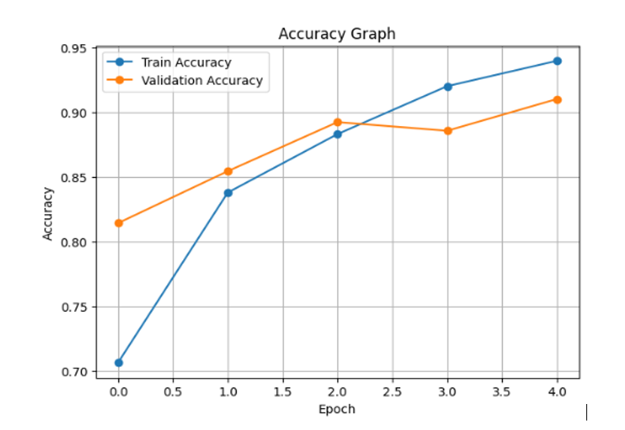
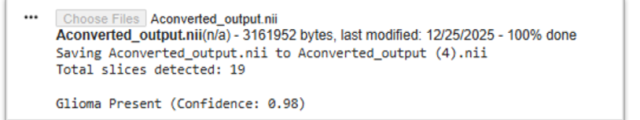
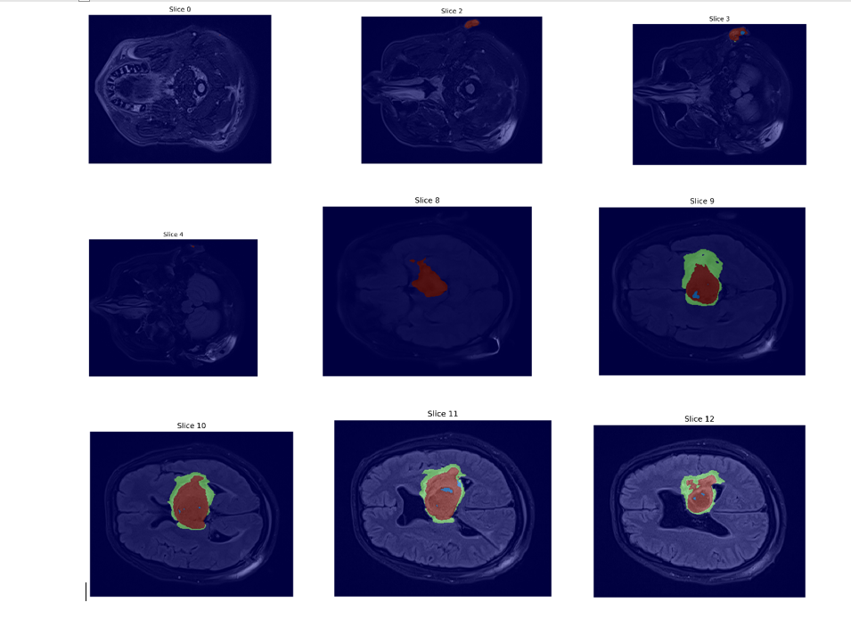

# Brain-Tumor-Detection-And-Segmentation-Using-MRI-Image
# 🧠 Brain Tumor Detection and Segmentation Using MRI Images

## 📌 Project Overview

This project presents a deep learning-based system for **Brain Tumor Detection** and **Brain Tumor Segmentation** using MRI images.

The project consists of two independent modules:

- **Brain Tumor Detection (Classification)** using a Convolutional Neural Network (CNN).
- **Brain Tumor Segmentation** using the nnU-Net framework.

The primary objective is to assist in the automatic detection and localization of brain tumors from MRI scans, helping improve the accuracy and efficiency of medical image analysis.

---

## ✨ Features

- Brain Tumor Detection using CNN
- Brain Tumor Segmentation using nnU-Net
- MRI Image Preprocessing
- Deep Learning Model Training
- Prediction on MRI Images
- Visualization of Detection Results
- Visualization of Segmentation Results
- Modular and Organized Project Structure

---

## 🧠 Models Used

### Brain Tumor Detection
- Convolutional Neural Network (CNN)

### Brain Tumor Segmentation
-  Pretrained nnU-Net model

---

## 📁 Project Structure

```
Brain-Tumor-Detection-And-Segmentation-Using-MRI-Image/
│
├── Detection/
│   └── CNNdetect_MODEL.ipynb
│
├── Segmentation/
│   └── nnunetv2MODEL.ipynb
│
├── images/
│   ├── detection-accuracy.png
│   ├── detection-loss.png
│   ├── detection_prediction1.png
│   ├── detection_prediction2.png
│   ├── segmentation_result1.png
│   └── segmentation_result2.png
│
├── requirements.txt
└── README.md
```

---

## 📂 Dataset

A custom brain MRI dataset was created by combining multiple publicly available brain tumor datasets.

**Note**

- The complete dataset (~5 GB) is **not included** in this repository because it exceeds GitHub's file size limits.
- Users should prepare the dataset with the required folder structure before running the notebooks.

---

## ⚙️ Installation

### Clone the repository

```bash
git clone https://github.com/nishu0910pundir/Brain-Tumor-Detection-And-Segmentation-Using-MRI-Image.git
```

### Move into the project directory

```bash
cd Brain-Tumor-Detection-And-Segmentation-Using-MRI-Image
```

### Install dependencies

```bash
pip install -r requirements.txt
```

---

## 🚀 How to Run

### Brain Tumor Detection

Open:

```
Detection/CNNdetect_MODEL.ipynb
```

Run all notebook cells.

---

### Brain Tumor Segmentation

Open:

```
Segmentation/nnunetv2MODEL.ipynb
```

Run all notebook cells.

---

## 🛠 Technologies Used

- Python
- TensorFlow
- Keras
- PyTorch
- nnU-Net
- NumPy
- OpenCV
- Matplotlib
- Scikit-learn
- Nibabel

---

## 📊 Results

The project demonstrates:

- Accurate Brain Tumor Detection using CNN.
- High-quality Brain Tumor Segmentation using nnU-Net.
- Visualization of model predictions.
- Training Accuracy and Loss Graphs.
- Segmentation output masks.

Sample outputs are available inside the **images** folder.

---

## 📷 Sample Results


### Detection Accuracy



### Detection Prediction



### Segmentation Result


---

## 🔮 Future Improvements

- Develop a web-based application.
- Support additional MRI modalities.
- Improve model accuracy with larger datasets.
- Integrate Explainable AI (XAI).
- Deploy the models using Flask or Streamlit.

---

## 👩‍💻 Author

**Nisha Pundir**

Master of Computer Applications (MCA)

Interested in:
- Artificial Intelligence
- Machine Learning
- Deep Learning
- Medical Image Analysis

---
